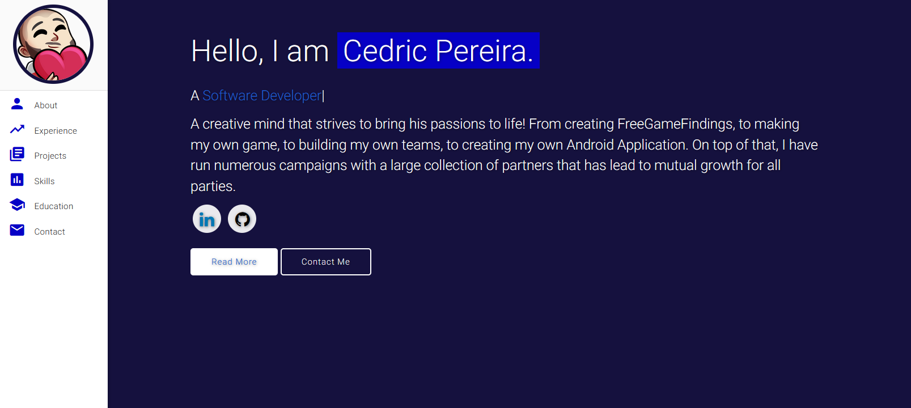

# A linktree alternative for /r/FreeGameFindings
> A list of all the official Free Game Findings links and related platforms with some examples and and direct links to follow. Think a simply LinkTree website, but with included details when possible. 

> Originally forked from Varad's Portfolio Template. Adjustments mande to better support mobile and create alternative pages to fit my needs. Check out the original and :star: their work if you're interested.

> Original: https://varadbhogayata.github.io - My work: https://github.com/StOoPiDU/StOoPiDU.github.io

### Website Preview

  <kbd>
    
  </kbd>

## Tools Used 🛠️
* [<b>GitHub Pages</b>](https://create-react-app.dev/docs/deployment/#github-pages) - To host the static website (HTML, CSS, JS).
* [<b>Materialize</b>](https://materializecss.com/) - A CSS framework to get Google's Material Design components.
* [<b>Typed.js</b>](https://mattboldt.com/demos/typed-js/) - JavaScript Library

## License 📄
This project is licensed under the MIT License - see the [LICENSE.md](./LICENSE) file for details.
